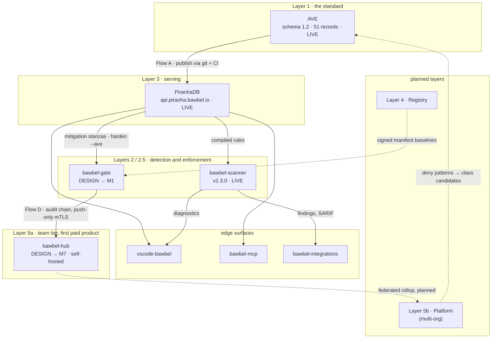
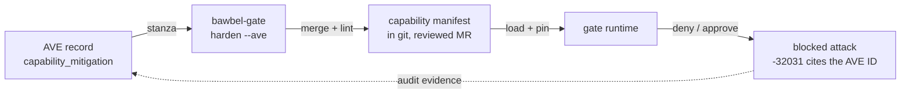
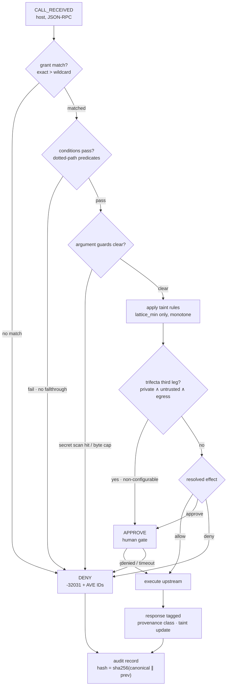
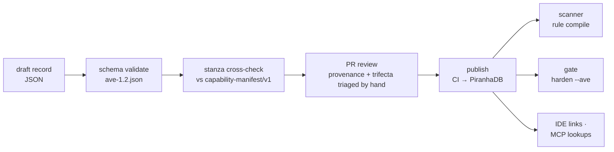

# bawbel ARCHITECTURE.md

**Document:** ARCH-ECO-001 · rev 2026-07
**Supersedes:** the five-layer sketch in PRODUCT.md
**Normative companions:** bawbel-gate DESIGN.md, AVE schema 1.2

---

## 1. High-level architecture

Seven components across six layers. Two things move through the system: **knowledge**
flows down (vulnerability classes become detection rules become enforcement policy),
and **evidence** flows up (findings, decisions, and audit chains become corpus
candidates and coverage metrics). Every layer consumes the layer below through a
versioned, public interface. No layer reaches around another.

```
                                                            knowledge   evidence
┌────────────────────────────────────────────────────────┐     │           ▲
│ LAYER 5b  bawbel platform                    [PLANNED] │     │           │
│           multi-org SaaS, ingest at scale              │     │           │
├────────────────────────────────────────────────────────┤     │           │
│ LAYER 5a  bawbel-hub                    [DESIGN → M7]  │     │           │
│           self-hosted fleet console, one org/team,     │     │           │
│           5-50 gates · FIRST PAID TIER                 │     │           │
├────────────────────────────────────────────────────────┤     │           │
│ LAYER 4   bawbel Registry                    [PLANNED] │     │           │
│           reviewed manifests + integrity pins          │     │           │
├────────────────────────────────────────────────────────┤     │           │
│ LAYER 3   PiranhaDB                             [LIVE] │     │           │
│           api.piranha.bawbel.io                        │     │           │
│           queryable AVE corpus, mitigation endpoint    │     │           │
├────────────────────────────────────────────────────────┤     ▼           │
│ LAYER 2.5 bawbel-gate                    [DESIGN → M1] │  classes     findings
│           runtime enforcement: manifests, taint,       │  → rules     → decisions
│           trifecta invariant, audit chain              │  → stanzas   → audit chains
├────────────────────────────────────────────────────────┤  → pins      → new class
│ LAYER 2   bawbel-scanner                 [LIVE v1.3.0] │     │        candidates
│           static detection: CLI, pre-commit, CI        │     │           │
├────────────────────────────────────────────────────────┤     │           │
│ LAYER 1   AVE                       [LIVE, 51 records] │     ▼           │
│           the standard: behavioral vulnerability       │                 │
│           classes for agentic systems, AIVSS-scored    │ ────────────────┘
└────────────────────────────────────────────────────────┘
```

Layer 5 splits into two tiers rather than one, because they answer different
questions. 5a (hub) answers "show me my team's fleet", is self-hosted, and has no
command channel into gates: it is DESIGN.md Section 14, next in the build sequence
(M7), and the first thing a paying team actually buys. 5b (platform) answers "show me
posture across many orgs" and stays a later, unscheduled bet; it is what a hub could
federate into, not a prerequisite for the hub to exist. bawbel-gate's embedded console
(13.1, v1.2) is unaffected by either: it is the single-gate view and stays free and
standalone regardless of which higher tier a deployment adopts.

Rendered view (Mermaid, renders on GitHub/GitLab; ASCII above kept for terminals).
Solid edges are knowledge flowing down; dashed edges are evidence flowing up and
planned paths:



Edge components (bawbel-mcp, vscode-bawbel, bawbel-integrations) are Layer 2/3
consumers packaged for specific surfaces. They add no new authority; see Section 3.

## 2. Data flows

Four named flows. Each is versioned at its interface boundary, so any component can be
reimplemented independently, including by a second implementer. That separability is a
strategic requirement, not an accident.

### Flow A · Publication: how a vulnerability class becomes queryable

```
research /          AVE record            ave repo              PiranhaDB        scanner · gate
field report ─────▶ (JSON, schema ──────▶ (git) ──────────────▶ (read-only ────▶ IDE · MCP
             triage  1.2)          PR      CI validate + deploy  serving)  HTTPS
                                   review
```

Git is the write path; PiranhaDB is read-only serving. A record is not "published"
until it validates against `schemas/ave-1.2.json` in CI, including cross-validation of
`capability_mitigation.manifest_stanza` against the capability-manifest schema. Schema
negotiation (`?schema=1.1|1.2`) keeps old consumers unbroken.

### Flow B · Detection: static, pre-deployment

```
agent codebase /              bawbel-scanner            findings                CI gate
MCP config /      ──────────▶ (rule match,  ──────────▶ (JSON/SARIF, ─────────▶ IDE diagnostics
server card                    AVE-compiled)             AVE-tagged)            reports
```

Rules are compiled from AVE classes; every finding carries its AVE ID, so a finding is
never an opinion, it is a citation. The scanner pulls rule updates from PiranhaDB but
ships a vendored corpus snapshot for air-gapped runs.

### Flow C · Enforcement loop: the closed loop that is the product thesis

```
AVE record ──────────▶ bawbel-gate ──────────▶ capability ──────────▶ gate ─────▶ blocked attack,
           mitigation  harden --ave  merge +   manifest    load +     runtime     deny cites the
           stanza                    lint      (git)       pin                    AVE ID back
```

Knowledge becomes policy mechanically: the scanner detects the class, the record emits
the stanza, the gate enforces it, and the denial names the record that caused it.
Taxonomy, detection, enforcement: all three layers owned and cross-referenced.



### Flow D · Telemetry: evidence, upward

```
gate audit chain            embedded console        bawbel-hub              fleet console
(JSONL,          ─────────▶ (v1.2, local,   ┌─────▶ (M7, self-hosted, ────▶ posture, drift,
 hash-linked)    SSE local   per-gate)       │        one org, NDJSON       trifecta, per-dev
                                             │        push mTLS)            and aggregate
                             gate ───────────┘              │
                                                             ▼ (planned, federated)
                                                    bawbel platform (5b)
```

The audit chain is the sync protocol: ordered, idempotent by
`(gate_id, session, seq)`, tamper-evident on ingest. Push-only; gates never accept
inbound connections, and neither does the hub push anything back down (DESIGN.md
14.6). Arguments travel as hashes, never payloads, by default. A single gate's
console (13.1) and a team's hub (14) are two independent consumers of the same
chain, not a pipeline; a deployment can run either, both, or neither. Recurring deny
patterns across teams are the eventual pipeline for new AVE class candidates via a
federated platform, which closes the loop back to Flow A, but that hop is planned,
not required for the hub to deliver its value today.

## 3. Projects

Each project: what it is, what it consumes, what it produces, and the interface it is
held to.

### ave (Layer 1, live: schema 1.2, 51 records)

The standard. CWE-shaped behavioral class definitions for agentic-system
vulnerabilities, scored with OWASP AIVSS v0.8. Since schema 1.2, records carry a
provenance vector (where in the context supply chain the class enters), a trifecta
profile (which legs make it exploitable), and an executable mitigation stanza.

- **Consumes:** research, incident reports, fleet deny patterns (Flow D).
- **Produces:** versioned JSON records; JSON Schemas for records and capability
  manifests.
- **Interface:** git repo + `schemas/ave-1.2.json`; docs at ave.bawbel.io.
- **Strategic gate:** second independent implementer before OWASP/MITRE outreach.

### bawbel-scanner (Layer 2, live: v1.3.0, PyPI)

Static detection. Scans agent codebases, MCP configurations, and server cards
(`scan-server-card`) against rules compiled from AVE classes. Runs as CLI, pre-commit
hook, and CI job; emits JSON and SARIF.

- **Consumes:** source trees, MCP configs, server-card JSON; corpus via PiranhaDB or
  vendored snapshot.
- **Produces:** AVE-tagged findings; exit codes for CI gating.
- **Interface:** CLI contract + SARIF 2.1.0; secret-detector set shared with the gate
  as a library, not forked.

### bawbel-gate (Layer 2.5, DESIGN.md complete, M1 next)

Runtime enforcement. MCP multiplexer proxy enforcing capability manifests, session
taint, and the rule-of-two trifecta invariant, with a hash-chained audit log,
integrity pinning (rug-pull detection), learning mode for manifest synthesis, and an
embedded console (v1.2).

- **Consumes:** MCP traffic; manifests from git; mitigation stanzas via
  `harden --ave`.
- **Produces:** allow/approve/deny decisions; audit chain; OTel spans; drift reports.
- **Interface:** capability-manifest/v1 schema; Console API (DESIGN.md 13.1); ingest
  protocol (DESIGN.md 13.2).

### piranhadb (Layer 3, live: Railway)

Read-only corpus API at `api.piranha.bawbel.io`. Serves AVE records with schema
negotiation, the per-record mitigation endpoint, and (post-backfill) posture queries.

- **Consumes:** ave repo on deploy (CI publishes validated records).
- **Produces:** `GET /records`, `GET /records/{id}/mitigation`, `?schema=`,
  `?trifecta=`.
- **Interface:** HTTPS JSON; additive versioning, 1.1 default until v2.0.

### bawbel-mcp (Layer 2/3 edge, Glama listing)

MCP server exposing scanner and corpus lookups to agents themselves, so an agent can
check a dependency or server card mid-task. Deliberately read-only and
trifecta-minimal: no private-data tools, no egress tools.

- **Consumes:** PiranhaDB; scanner as a library.
- **Produces:** lookup/scan tools over MCP.
- **Interface:** MCP; ships its own capability manifest as reference practice.

### vscode-bawbel (Layer 2 edge, live: v1.1.1, Marketplace)

IDE surface. Inline diagnostics from scanner findings while editing agent code and
MCP configs; each diagnostic links to its AVE record on ave.bawbel.io.

- **Consumes:** bawbel-scanner output (local invocation).
- **Produces:** editor diagnostics, quick links, quick-fix hints where a stanza
  exists.
- **Interface:** VS Code extension API; no network calls beyond corpus refresh.

### bawbel-integrations (Layer 2 edge, live)

Packaged CI/CD recipes: GitLab CI templates, GitHub Actions, pre-commit hooks wiring
the scanner (and, from M2, `bawbel-gate lint`) into pipelines with sane defaults.

- **Consumes:** scanner CLI, gate lint CLI.
- **Produces:** drop-in pipeline includes; the prod egress-invariant job
  (DESIGN.md 11.3).
- **Interface:** CI template contracts, versioned tags.

### bawbel-registry (Layer 4, planned)

Reviewed capability manifests and integrity pins for widely used MCP servers, so a
deployment starts from an audited manifest instead of learning mode alone. Registry
entries are signed; `harden` and `learn synthesize` consume them as baselines.

- **Consumes:** community + curated manifest submissions; server classification data.
- **Produces:** signed manifest baselines, trifecta classifications, pin sets.
- **Interface:** HTTPS + sigstore-style verification (open design question: signing
  identity, see DESIGN.md 12).

### bawbel-hub (Layer 5a, DESIGN.md 14 complete, M7 next, first paid tier)

Self-hosted fleet console for one team or org: 5-50 gates, one console. Every
developer's gate pushes its audit chain to the hub over mTLS; the hub replays it into
fleet state and serves the posture view, per-developer drill-down, and the CISO
report fleet-wide. No command channel: the hub cannot decide approvals, cannot reach
into a gate, and cannot push configuration. bawbel-gate (including its own embedded
console, 13.1) stays free and fully standalone; the hub is the paid line, drawn at
"more than one gate."

- **Consumes:** gate audit chains (push, mTLS); manifest repo (read, for drift
  cross-check).
- **Produces:** fleet posture, per-gate config-drift flags, fleet-wide CISO posture
  report.
- **Interface:** ingest protocol 13.2 (same protocol the M6 stub server proves);
  enrollment via single-use token, gate identity via per-gate mTLS client cert.

### bawbel platform (Layer 5b, planned)

Fleet console at multi-org scale: federated rollup from many hubs, org auth, and
corpus-candidate mining from deny patterns aggregated across customers. Observer
only; its write path into hubs, and into gates, is none. Not a prerequisite for the
hub; a hub deployment is complete and useful on its own.

- **Consumes:** hub rollups (planned) or gate audit chains directly at larger scale;
  manifest repos (read).
- **Produces:** cross-org dashboards, aggregate posture benchmarking, AVE candidates
  mined from fleet-wide deny patterns.
- **Interface:** ingest protocol 13.2, frozen by the M6 stub server and exercised in
  production by the hub before any platform-scale extension is designed.

## 4. Low-level: the two pipelines that matter

### 4.1 Gate decision pipeline (per tool call)

```
CALL_RECEIVED (host, JSON-RPC)
  └─▶ resolve grant        exact name > wildcard; no match → DENY
  └─▶ conditions           dotted-path predicates on args; fail → DENY (no fallthrough)
  └─▶ argument guards      secret scan (shared detector lib) + byte caps → DENY
  └─▶ taint rules          session classes vs manifest rules; lattice_min only
  └─▶ trifecta invariant   private ∧ untrusted ∧ egress-tool → ≥ APPROVE (non-configurable)
  └─▶ verdict:             ALLOW → execute upstream
                           APPROVE → human gate (timeout → deny)
                           DENY → -32031 + AVE IDs
  └─▶ response tagged      provenance class recorded; taint/trifecta flags update (monotone)
  └─▶ audit record         hash = sha256(canonical(record) ∥ prev)   <- the chain Flow D ships
```

Rendered:



### 4.2 Corpus pipeline (per AVE record)

```
draft record (JSON)
  └─▶ schema validate      ave-1.2.json, draft 2020-12
  └─▶ stanza cross-check   capability_mitigation.manifest_stanza validates against
                           capability-manifest/v1
  └─▶ review               PR; triage sets provenance_vector + trifecta_profile
                           (never auto-guessed)
  └─▶ publish              CI deploy → PiranhaDB; ?schema=1.1 strips new fields
                           for old consumers
  └─▶ consume              scanner rule compile │ harden --ave stanza merge │
                           IDE links │ MCP lookups
```

Rendered:



### 4.3 Interface freeze points

| Interface | Version | Consumers held to it |
|---|---|---|
| ave record schema | 1.2 (additive over 1.1) | PiranhaDB, scanner, gate, IDE, second implementers |
| capability-manifest | v1 | gate, registry (planned), AVE mitigation stanzas |
| Console API | DESIGN.md 13.1 | embedded console UI (single gate), hub's per-developer drill-down |
| ingest protocol | DESIGN.md 13.2 (frozen via M6 stub) | bawbel-hub (M7, real), future platform (planned) |
| SARIF findings | 2.1.0 | CI systems, GitLab/GitHub security tabs |

## 5. Where you touch the system

### 5.1 Developers

You mostly never see Bawbel; that is the design goal. The approval budget is a release
gate: p95 of sessions produce zero prompts.

- **vscode-bawbel:** inline diagnostics on agent code and MCP configs while you type;
  every squiggle links to the AVE class explaining why.
- **pre-commit (scanner):** same rules as CI, locally, before the pipeline tells you.
- **-32031 deny errors:** when your agent's tool call is blocked, the error names the
  reason and the AVE ID. It is not flaky infrastructure; the FAQ resolves every
  reason string.
- **approval prompt (rare):** one keystroke, full context shown. Routine prompts on
  benign work are a bug against the budget; report them.

Touches: Flow B, edges of Flow C.

### 5.2 DevOps

The gate is a stateless-ish sidecar: one process, no daemons, audit JSONL as the only
persistent artifact. Manifests are environment-promoted files in git like any other
config.

- **gate.yaml + manifests/{env}/:** deployment surface. dev is wide, prod is narrow;
  promotion is an MR.
- **bawbel-gate lint (CI):** schema lint plus the prod invariant
  (`--forbid-effect allow --tools-with external_comms`) proves prod cannot silently
  egress, statically.
- **OTel spans + events:** p95 decision overhead <= 5 ms is asserted in CI; per-call
  spans and six alertable event classes land in your existing collector.
- **learning mode:** seven observed days synthesize a draft default-deny manifest per
  server; onboarding is a report review, not YAML authorship from scratch.
- **bawbel-hub (once the team has more than one gate):** enroll each workstation
  once (`bawbel-gate enroll --hub ...`); the fleet posture view and per-gate
  config-drift flags replace checking each machine by hand.

Touches: Flow C (deploy side), Flow D (collection).

### 5.3 DevSecOps / Security

You own the loop: classes in, policy out, evidence back. Every control maps to a
framework row (DESIGN.md Appendix A: PCI DSS v4.0, ISO 27001, NIST, NBC TCRMG).

- **AVE triage:** provenance vector + trifecta profile per record; the posture query
  answers "which classes apply to us" mechanically.
- **bawbel-gate harden --ave:** a published class becomes enforced policy as a
  reviewed diff, in minutes, with the denial citing the record back.
- **drift runbook:** suspension means remote content changed after review. Read the
  semantic diff, then `verify --accept` or keep it suspended. This is the rug-pull
  control.
- **audit chain + SIEM:** hash-chained forensics; `gate.chain.gap` is a critical
  tamper indicator, not a sync warning. Alert classes reach your SIEM via OTel/CEF.
- **approval channel:** trifecta third-leg decisions surface to a human with full
  context. Who that human is (developer vs security) is a deployment policy choice;
  centralized SOC approval is deliberately deferred to the platform era
  (DESIGN.md 13.4).
- **fleet posture (bawbel-hub, DESIGN.md 14):** one view across the whole team once
  there is more than one gate: sessions, trifecta-locked count, denies, drift, and
  manifest hash per developer. The hub is read-only into every gate by design; it
  reports the fleet's state, it does not command it.

Touches: Flows A, C, D end-to-end.

---

Knowledge flows down, evidence flows up, and no layer reaches around another.
