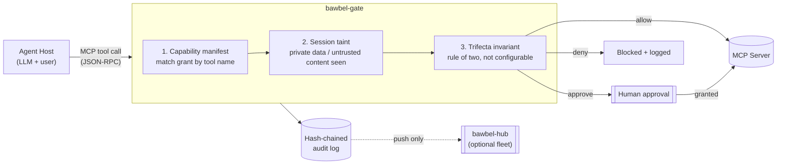
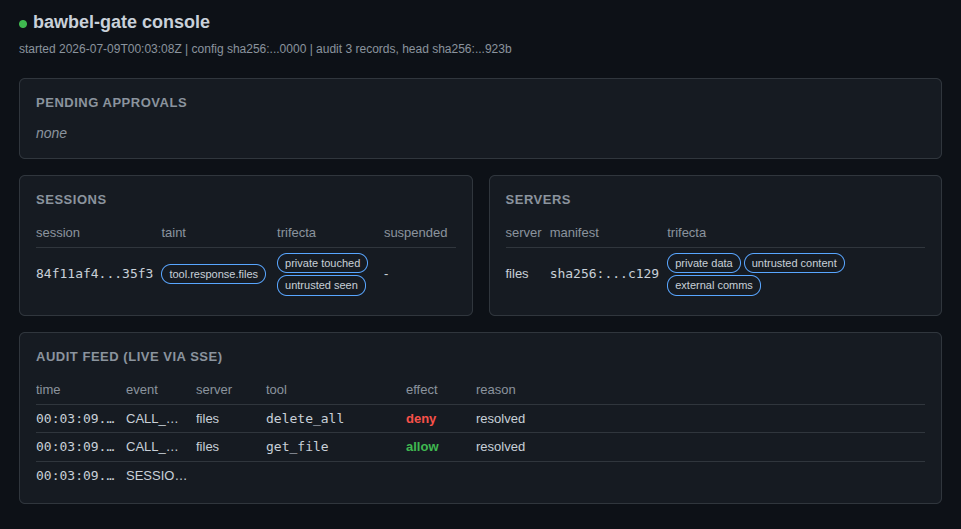

# bawbel-gate

[](./LICENSE)
[](./pyproject.toml)
[-orange)](#status-v10-feature-complete-pre-release)
[](#install-development)
[](./DESIGN.md)

Runtime enforcement for MCP agents: capability manifests, session taint tracking, and
a non-configurable rule-of-two trifecta invariant, with a hash-chained audit log.

## Status: v1.0 feature-complete (pre-release)

The full enforcement core, integrity layer, operations stack, embedded console, and
fleet hub are implemented. 324 tests pass. The public API is stable; the release
package is not yet on PyPI.

## The problem

Agent hosts grant flat trust to everything in context. A tool response, a skill
file, and a user message carry equal instruction authority inside the model, because
the model processes one token sequence with no privilege boundary. That is not
fixable at the model layer. bawbel-gate fixes the consequence layer instead: a
deterministic proxy between the agent host and its MCP servers that enforces
per-component capability grants, session taint, and the trifecta invariant,
regardless of what the model decides to do.

## How it works



Every tool call from the agent host passes through three checks before it ever
reaches a real MCP server: does a capability grant match this tool, has this
session's taint state crossed the rule-of-two threshold, and does the trifecta
invariant require a human in the loop. Every decision, allowed or not, is written
to an append-only hash-chained audit log. The gate never reads model output to make
these decisions -- only structured JSON-RPC.

## What is built

| Milestone | Component | Status |
|---|---|---|
| M0 | Project scaffold, schemas, migration script | done |
| M1 | MCP multiplexer, learning mode, audit skeleton | done |
| M2 | Policy engine, taint tracker, trifecta invariant, audit chain | done |
| M3 | Integrity pinning, drift detection, `harden --ave` | done |
| M4 | Approval UX budget, benign corpus, latency gates | done |
| M5 | OTel spans, CEF/syslog export, posture report | done |
| M6 | Embedded console + Console API | done |
| M7 | bawbel-hub: fleet ingest, state store, enrollment | done |

### Policy engine (M2)

Six-step decision pipeline per DESIGN.md 5.2:

1. Match grant by tool name (exact then wildcard).
2. No match -> `deny: no_grant`. Fail closed.
3. Conditions fail -> `deny: condition_failed`. No fallthrough to next grant.
4. Argument guards: secret scan and byte cap.
5. Taint rules: `lattice_min` only, effects never rise.
6. Trifecta invariant: `private_touched AND untrusted_seen AND external_comms` ->
   at least `approve`. Cannot be disabled by any manifest field or flag.

Effect lattice: `allow (2) > approve (1) > deny (0)`. Deny absorbs everything.

### Trifecta invariant

The rule-of-two protection against prompt injection exfiltration. When a session
has touched private data, seen untrusted content (a tool response, a web fetch, an
issue body), and calls a tool with external comms capability, a human must approve.
This is not configurable. No manifest field, environment variable, or debug flag
can bypass it.

### Integrity pinning (M3)

Tool schemas are hashed at review time (`bawbel-gate verify`). On each session
start the gate re-hashes and compares. Any mutation -- a poisoned description, an
injected tool, a rug-pull -- is detected as drift. The server is suspended
(`on_drift: suspend`) and all its tools withheld until the operator runs
`bawbel-gate verify --accept` after reviewing the diff.

### Audit log (M2)

Append-only JSONL. Every record carries `hash = sha256(canonical(record) || prev)`.
The chain is verified on demand (`bawbel-gate audit verify`). Argument payloads are
hashed, not stored, by default (`args_sha256`). The forensic record is local and
tamper-evident; the OTel/SIEM export is an operational feed on top of it.

### Embedded console (M6)

`bawbel-gate serve --console 127.0.0.1:7317` starts a loopback HTTP server. A
random bearer token is printed once at startup. Endpoints:

| Endpoint | Method | Description |
|---|---|---|
| `/v1/state` | GET | Full snapshot: sessions, servers, pending approvals, audit head |
| `/v1/events` | GET | SSE stream of audit records as they are written |
| `/v1/approvals/{id}` | POST | Console approval channel (race-safe: first writer wins) |
| `/` | GET | Embedded UI bundle |

The console is read-only except for the approval endpoint. No endpoint can issue
tool calls, edit manifests, or clear taint; those remain CLI-only.

`/v1/state` reflects live session taint and per-server manifest state as the gate
runs:



### bawbel-hub (M7)

Self-hosted fleet manager for teams running more than one gate. Push-only: gates
push audit records to the hub; the hub never connects inward.

- Ingest service (`POST /v1/gates/{gate_id}/records`): verifies hash chains per
  session, stores records idempotent by `(gate_id, session_id, seq)`, quarantines
  and raises `gate.chain.gap` on tamper evidence.
- Fleet state store: SQLite (eval) or Postgres (prod), fully rebuildable from raw
  records.
- Single-use enrollment tokens: `bawbel-gate hub token new`, then
  `bawbel-gate enroll --hub URL --token TOKEN`.
- Fleet posture API: `GET /v1/fleet/state` returns per-gate allow/approve/deny
  counts, trifecta trips, and drift events.

## Install (development)

```bash
git clone https://github.com/chaksaray/bawbel-gate
cd bawbel-gate
pip install -e ".[dev]" --break-system-packages
pytest                        # 324 tests
pre-commit run --all-files    # lint gate
```

With OTel export:

```bash
pip install -e ".[dev,ops]" --break-system-packages
export OTEL_EXPORTER_OTLP_ENDPOINT=http://localhost:4317
```

## Quickstart

Point your MCP client at the gate instead of your servers directly:

```json
{
  "mcpServers": {
    "bawbel-gate": {
      "command": "bawbel-gate",
      "args": ["serve", "--config", "gate.yaml"]
    }
  }
}
```

No manifests yet? Run learning mode first:

```bash
bawbel-gate serve --config gate.yaml --learn
bawbel-gate learn report
bawbel-gate learn synthesize --out manifests/
```

Lint your manifests before enforcement:

```bash
bawbel-gate lint manifests/ --forbid-effect allow --tools-with external_comms
```

Harden a manifest against a known attack pattern:

```bash
bawbel-gate harden --ave AVE-2026-00041 --manifest manifests/github-mcp.cap.yaml --write
```

`harden` merges the AVE record's mitigation stanza into your manifest and prints the
diff before writing anything (drop `--write` to preview only).

Pin tool schemas after review:

```bash
bawbel-gate verify tools.json manifests/github-mcp.cap.yaml --accept
```

Minimal manifest (see DESIGN.md 4.1 for the annotated version):

```yaml
schema: bawbel/capability-manifest/v1
subject:
  kind: mcp-server
  name: github-mcp
provenance_class: tool.response.github
instruction_authority: none
trifecta:
  private_data: true
  untrusted_content: true
  external_comms: true
grants:
  tools:
    - name: get_issue
      effect: allow
    - name: create_pull_request
      effect: allow
      conditions:
        args.base_repo: {pattern: "myorg/*"}
    - name: "*"
      effect: deny
```

## CLI reference

```
bawbel-gate serve       --config gate.yaml [--learn] [--console HOST:PORT]
bawbel-gate audit       verify FILE | tail FILE [--follow]
bawbel-gate learn       report | synthesize --out DIR
bawbel-gate lint        MANIFEST_DIR [--forbid-effect EFFECT] [--tools-with FLAG]
bawbel-gate verify      TOOLS_JSON MANIFEST [--accept]
bawbel-gate harden      --ave AVE_ID [--manifest FILE] [--write] [--allow-unreviewed]
bawbel-gate posture     [--audit-log FILE] [--json]
bawbel-gate clear       --session SESSION_ID --confirm [--audit-log FILE]
bawbel-gate enroll      --hub URL --token TOKEN
bawbel-gate hub         serve [--db FILE] [--host HOST] [--port PORT]
bawbel-gate hub         token new [--db FILE]
```

## Deny reasons

The closed set from DESIGN.md 6.2. Any deny carries exactly one:

| Reason | Cause |
|---|---|
| `no_grant` | No grant matched the tool name |
| `condition_failed` | A matched grant's condition was not satisfied |
| `trifecta_third_leg` | Trifecta invariant triggered; human approval required |
| `guard:secret_scan` | Argument contained a secret pattern |
| `guard:byte_cap` | Argument exceeded the outbound byte cap |
| `approval_timeout` | Human did not respond within the approval window |
| `approval_denied` | Human denied the approval request |
| `drift:suspended` | Server is suspended due to tool-schema drift |
| `parse_error` | Malformed JSON-RPC request |

## Alertable events (OTel / CEF)

Six event classes emitted as structured records regardless of exporter:

| Event | Default severity | Meaning |
|---|---|---|
| `gate.drift.detected` | high | Supply-chain mutation post-review |
| `gate.trifecta.trip` | medium | Injection precondition reached |
| `gate.deny.burst` | medium | Agent probing outside granted surface |
| `gate.secretscan.hit` | high | Exfiltration attempt via arguments |
| `gate.approval.timeout` | low | Unattended agent hit a human gate |
| `gate.chain.gap` | critical | Audit log tamper indicator |

## Non-goals

- Not a prompt filter. Every enforcement decision reads structured JSON-RPC only;
  the gate never consults what the model said.
- No fail-open mode, no configurable trifecta bypass, no "trust this server fully"
  toggle.
- No inbound connections to gates, ever, in any deployment shape.
- No argument payload storage by default. Records carry `args_sha256`.

## Documentation

- [DESIGN.md](./DESIGN.md) - normative specification.
- [ARCHITECTURE.md](./ARCHITECTURE.md) - ecosystem map.
- [IMPLEMENTATION_PLAN.md](./IMPLEMENTATION_PLAN.md) - milestone sequence.
- [BAWBEL_GATE_MITIGATIONS_SPEC.md](./BAWBEL_GATE_MITIGATIONS_SPEC.md) - enforcement policy details.
- [docs/LANGUAGE.md](./docs/LANGUAGE.md) - canonical terminology.

## Related projects

- [AVE](https://ave.bawbel.io) - the behavioral vulnerability classification
  standard bawbel-gate enforces against (`bawbel-gate harden --ave`).
- [bawbel-scanner](https://pypi.org/project/bawbel-scanner/) - static detection
  for agent codebases, MCP configs, and server cards.
- [PiranhaDB](https://api.piranha.bawbel.io) - the queryable AVE corpus API.

## Security

See [SECURITY.md](./SECURITY.md) for the disclosure policy. Do not open a public
issue for a vulnerability.

## License

Apache-2.0. The gate is fully standalone and open. bawbel-hub (fleet management for
more than one gate) is the paid tier; see DESIGN.md 14 for the boundary.

## Contributing

See [CONTRIBUTING.md](./CONTRIBUTING.md). Read DESIGN.md before opening a PR that
touches `policy/`, `taint/`, `audit/`, or `integrity/`: behavior that diverges from
the spec needs a DESIGN.md change first, not a larger diff.
